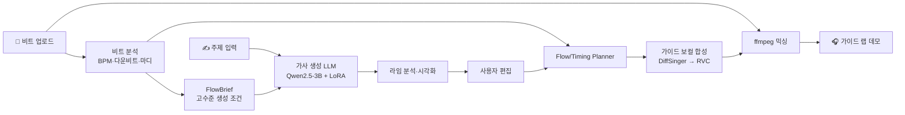

# PMTM

**비트를 올리면, AI가 라임을 짜고 직접 랩으로 들려줍니다.**

한국어 랩의 *작사 → 편집 → 플로우 → 가이드 보컬*을 하나의 작업 흐름으로 잇는 창작 보조 도구입니다.

---

## 무엇을 하는가

일반 LLM은 "랩처럼 보이는" 가사는 만들지만 라임과 반복 억제 품질이 불안정하고, 일반 TTS는 박자와 강세를 직접 제어하기 어렵습니다.

PMTM은 업로드한 비트를 분석해 BPM과 마디를 추출하고, 그 조건에 맞춰 8마디 한국어 랩 가사를 생성합니다. 사용자가 가사를 줄 단위로 고치면 라임이 실시간으로 색으로 표시되고, 완성된 가사는 가이드 보컬로 합성되어 비트 위에 얹힙니다.

결과물은 상업 발매용 완성 음원이 아니라, **작사와 플로우를 빠르게 검토하기 위한 가이드 데모**입니다.

<!-- TODO: 라임 시각화 화면 스크린샷 추가 -->

## 주요 기능

- **비트 분석** — 업로드한 오디오에서 BPM, 다운비트, 마디 경계, 드럼 밀도를 추출합니다.
- **8마디 가사 생성** — Qwen2.5-3B 기반 LoRA 모델이 주제와 비트 조건에 맞춰 정확히 8줄을 생성합니다. OpenAI 모델로 전환할 수도 있습니다.
- **라임 시각화** — 끝라임과 내부 라임을 그룹별 색상으로 표시합니다. `ABAB` 같은 교차 라임과 어절 경계를 넘는 라임까지 탐지합니다.
- **줄 단위 편집** — 가사를 고치면 라임 분석이 즉시 다시 계산됩니다.
- **가이드 랩 데모** — DiffSinger로 가이드 보컬을 합성하고 RVC로 음색을 바꾼 뒤 비트와 믹싱합니다.

## 설계 원칙: 가사와 플로우의 분리

가사 LLM은 **최종 타이밍을 결정하지 않습니다.** 비트에서 파생된 고수준 `FlowBrief`를 조건으로 받아 의미와 라임 품질에만 집중하고, 정확한 구절 위치·음소 duration·쉼·강세는 별도의 Flow/Timing Planner가 결정합니다.

같은 가사와 비트에도 half-time, double-time, 당김음이 다른 여러 유효한 플로우가 존재하기 때문입니다. 이렇게 분리하면 **좋은 가사를 유지한 채 플로우만 바꾸거나, 플로우를 유지한 채 가사 일부만 고칠 수 있습니다.**

자세한 내용은 [`docs/project-goal.md`](docs/project-goal.md)를 참고하세요.

## 파이프라인



## 라임 채점

한국어 음운 기반 라임 채점기를 직접 구현했습니다. 자모 분해와 G2P로 각 음절의 모음·종성을 추출하고, 유사 모음군(`ㅏ/ㅑ/ㅘ`, `ㅡ/ㅜ` 등)까지 묶어 라임을 점수화합니다.

이 점수는 두 곳에서 쓰입니다.

1. **GRPO 보상 함수** — 모델이 라임을 학습하도록 강화학습 리워드로 직접 사용합니다.
2. **편집 화면 시각화** — 사용자에게 어느 구간이 라임인지 색으로 보여줍니다.

구현은 [`pmtm-ai/app/rhyme_scoring`](pmtm-ai/app/rhyme_scoring)에 있습니다.

## 기술 스택

| 영역 | 사용 기술 |
|---|---|
| Frontend | Next.js 15, React 19, TypeScript, Tailwind CSS |
| Backend | FastAPI, PostgreSQL, Redis + RQ |
| 가사 AI | Qwen2.5-3B-Instruct, LoRA, TRL (SFT / GRPO) |
| 오디오 | librosa, DiffSinger, RVC, ffmpeg |

## Structure

- `pmtm-fe`: Next.js 프론트엔드
- `pmtm-be`: FastAPI 백엔드
- `pmtm-ai`: 가사 생성 AI 학습/추론 코드 영역
- `pmtm-svs`: 8마디 DiffSinger 가이드 랩 추론 런타임
- `docs/`: 프로젝트 목표 및 발표 자료
- `docker-compose.yml`: 로컬 인프라 실행

---

## Local Development

### 1. Frontend

```bash
cd pmtm-fe
npm install
npm run dev
```

기본 주소: `http://localhost:3100`

### 2. Backend

백엔드는 로컬에서 실행합니다. 가사 생성은 업로드한 비트 파일을 `librosa`로 분석해 BPM을 추정한 뒤,
`pmtm-ai/venv`의 `Qwen/Qwen2.5-3B-Instruct` 추론 CLI를 호출합니다.
LLM 선택값 `qwen-exp-005-sft`는 `pmtm-ai/models/exp-005/sft_rap_qwen`, `qwen-exp-005-grpo`는 `pmtm-ai/models/exp-005/grpo_rap_qwen` LoRA 어댑터를 적용합니다.
OpenAI 선택지를 사용하려면 `OPENAI_API_KEY`를 설정합니다.

```bash
cd pmtm-be
python3 -m venv .venv
source .venv/bin/activate
pip install -r requirements.txt
uvicorn app.main:app --reload --host 0.0.0.0 --port 8100
```

기본 주소: `http://localhost:8100`

비트 기반 생성 API는 `POST /api/v1/lyrics/generate-from-beat`를 사용합니다.
요청 형식은 `multipart/form-data`이며 `beat` 오디오 파일과 `llm` 값을 보냅니다.
지원 형식은 MP3, WAV, M4A/MP4, AAC, FLAC이고 파일은 임시 분석 후 저장하지 않습니다.

편집된 가사로 DiffSinger 가이드 랩을 만드는 API는 `POST /api/v1/guide-demos`를 사용합니다.
요청 형식은 `multipart/form-data`이며 `beat`, `lyrics`, `bpm`, `firstBarStartSec`, `voicebank` 값을 보냅니다.
가사는 비어 있지 않은 정확히 8줄이어야 하며 1줄을 1마디로 렌더링합니다.
응답의 `jobId`로 `GET /api/v1/demos/{jobId}`를 polling하고, 완료 후 `GET /api/v1/demos/{jobId}/audio`에서 데모 오디오를 받을 수 있습니다.
드라이 보컬은 `GET /api/v1/demos/{jobId}/vocal`, FlowPlan은 `GET /api/v1/demos/{jobId}/flow-plan`에서 받습니다.
데모 생성은 Redis + RQ 비동기 작업이므로 백엔드와 별도로 워커를 실행해야 합니다.

```bash
cd pmtm-be
source .venv/bin/activate
PYTHONPATH=. rq worker demo-generation --worker-class rq.SimpleWorker --url redis://localhost:6380/0
```

로컬 macOS 개발에서는 기본 RQ worker의 fork 방식이 `librosa`/오디오 분석 단계에서 멈출 수 있어 `rq.SimpleWorker`를 사용합니다.

SVS는 `pmtm-svs`의 별도 Python 3.8 환경과 사용자가 직접 준비한 OpenUtau DiffSinger 보이스뱅크가 필요합니다.
설치 및 `potg`, `kitane`, `rang`, `lunar` 디렉터리 구성은 `pmtm-svs/README.md`를 따릅니다.
보이스뱅크 파일은 저장소에 포함하거나 재배포하지 않습니다.
MP3/M4A 등 비-WAV 비트 처리와 MP3 데모 출력을 위해 로컬 `ffmpeg` 설치가 필요합니다.

### 3. Local Infrastructure

Docker Compose로 PostgreSQL, Redis만 실행합니다. 프론트엔드와 백엔드는 로컬에서 직접 실행합니다.

```bash
docker compose up
```

서비스:

- postgres: `localhost:5433`
- redis: `localhost:6380`

OpenAI 선택지를 사용하려면 `pmtm-be/.env` 또는 `pmtm-be/.env.local`에 키를 넣습니다.

```bash
OPENAI_API_KEY=your_api_key
OPENAI_MODEL=gpt-5-mini
```

Qwen 로컬 추론은 `pmtm-ai`의 별도 Python 환경과 모델 캐시가 필요합니다. 로컬 개발에서는 백엔드도 로컬 Python 환경에서 실행합니다.

## AI Workspace

`pmtm-ai`는 모델 학습, 추론, 데이터셋, 체크포인트 자산을 분리해서 다루는 디렉터리입니다.

```bash
cd pmtm-ai
python3 -m venv .venv
source .venv/bin/activate
pip install -r requirements.txt
```

현재 로컬 기본 추론 모델은 `Qwen/Qwen2.5-3B-Instruct`입니다. 모델 파일은 Hugging Face 캐시에 있어야 하며, 백엔드 기본 설정은 `pmtm-ai/.venv/bin/python`을 호출합니다.
exp-005 시연 모델은 `llm=qwen-exp-005-sft` 또는 `llm=qwen-exp-005-grpo`로 호출하며, 어댑터 파일은 각각 `pmtm-ai/models/exp-005/sft_rap_qwen`, `pmtm-ai/models/exp-005/grpo_rap_qwen`에 있어야 합니다.
OpenAI 선택지의 기본 모델은 `gpt-5-mini`입니다.

## License / 사용 원칙

- 특정 아티스트의 목소리나 스타일을 무단 복제하지 않습니다.
- 학습 데이터, 비트, 보컬 모델은 사용 권한과 라이선스를 확인해 사용합니다.
- 보이스뱅크 파일은 저장소에 포함하거나 재배포하지 않습니다.
