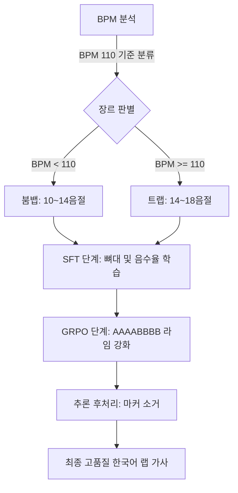

# 힙합 비트와 랩 작사 지식

## 1. 힙합 비트

모든 힙합 비트(붐뱁, 트랩, 드릴, 레이지, 플러그앤비 등)는 대부분 4/4박자이다.

| 장르 | 전형적인 BPM 범위 | 박자감의 특징 |
| :--- | :--- | :--- |
| **붐뱁 (Boom Bap)** | **80 ~ 95 BPM** | * 가장 느긋하고 인간의 심장 박동과 비슷한 속도입니다.<br>* 4박자를 정직하게 느끼며 머리를 위아래로 끄덕이기 가장 좋은 속도감입니다. |
| **트랩 (Trap)** | **130 ~ 150 BPM**<br>*(하프타임 체감: 65~75)* | * 실제 BPM은 빠르지만, 스네어가 3박에만 떨어지는 **하프타임**을 써서 몸으로 느끼는 속도는 느긋합니다.<br>* 대신 그 여백을 아주 잘게 쪼개진 하이햇이 채워줍니다. |
| **드릴 (Drill)** | **140 ~ 145 BPM** | * 트랩과 속도는 비슷하지만, 스네어의 위치가 한 박자씩 어긋나며 절뚝거립니다.<br>* **808 베이스가 미끄러지듯 움직이는(슬라이드)** 속도가 아주 빨라 속도감이 강하게 느껴집니다. |
| **레이지 (Rage)** | **130 ~ 150 BPM** | * 트랩 드럼 기반이지만, 신디사이저가 쉴 새 없이 몰아쳐서 체감 속도가 트랩보다 훨씬 빠르고 꽉 찬 느낌을 줍니다. |
| **저지 클럽 (Jersey Club)** | **130 ~ 140 BPM** | * **"쿵-쿵-쿵-쿠쿵!"** 하는 5박자 킥 패턴을 사용합니다.<br>* 4/4박자 마디 안을 5번의 킥으로 쪼개서 채우기 때문에 댄스곡처럼 엄청나게 신나고 템포가 빠르게 느껴집니다. |
| **플러그앤비 (Plugg_B)** | **120 ~ 140 BPM** | * 속도 자체는 트랩과 비슷하지만, 멜로디가 R&B처럼 아주 부드럽고 여유롭게 흘러가기 때문에 체감상 가장 평화롭고 나른하게 느껴집니다. |

### 1.1 큰 뼈대: 붐뱁과 트랩

#### 붐뱁 비트의 스네어 위치
| 1박 | 2박 | 3박 | 4박 |
| :---: | :---: | :---: | :---: |
| 킥 | **스네어** | 킥 | **스네어** |

#### 트랩 비트의 스네어 위치 (하프 타임)
| 1박 | 2박 | 3박 | 4박 |
| :---: | :---: | :---: | :---: |
| 킥 | | **스네어** | |

---

## 2. 랩 작사 원리

랩은 보통 **스네어 소리를 기준으로 라임을 위치**하게 한다. 스네어가 가장 큰 소리이고 타격감을 극대화하기 위해서이다.

### 마디(줄)당 권장 음절 수
* **붐뱁:** 10 ~ 14 음절
* **트랩:** 14 ~ 18 음절

### 2.1 랩의 3대 요소: 라임, 리듬, 플로우

#### A. 라임 (Rhyme)
스네어의 위치에 라임을 배치하는 것이 타격감이 좋다.

##### 라임 스키마 (Rhyme Scheme)
* **ABAB (전형적인 형태)**
  
  | 가사 (영어 예시) | 라임 구분 |
  | :--- | :---: |
  | Bid me to weep, and I will weep | **A** |
  | While I have eyes to see | **B** |
  | And having none, yet I will keep | **A** |
  | A heart to weep for thee | **B** |

* **요즘 트렌드:** `AAAABBBB` 또는 `AAAAAAAA`
* **템포 및 플로우에 따른 설계:**
  * **`ABCABC` (브레이크):** 라임의 주기를 길게 늘여서, 청자에게 여유를 주고 가사의 서사에 집중하게 만드는 '느긋한 플로우'용 설계도.
  * **`AAAA` (액셀):** 라임의 주기를 극도로 좁혀서, 청자의 귀를 쉬지 않고 때리며 속도감과 쾌감을 극대화하는 '빠르고 타이트한 플로우'용 설계도.

#### B. 리듬 (Rhythm)
리듬은 시간의 흐름 속에서 소리가 언제 켜지고 언제 꺼지는지, 그리고 그 소리가 얼마나 길고 짧은지를 결정하는 것이다.
1. 음절 수
2. 길이 (Duration): 길게 뱉을지, 빠르게 뱉을지 결정
3. 쉼 (Rest)

#### C. 플로우 (Flow)
플로우는 리듬 위에서 어떻게 뱉을지 결정하는 것이다. 사실상 플로우 안에 리듬이 포함되어 있는 개념이다.

래퍼들의 언어로는 **"플로우 짠다"**는 말 한마디가 이 모든 리듬과 스타일의 설계를 끝내겠다는 뜻과 같다.

---

## 3. PMTM AI 학습 아키텍처 및 파이프라인 설계

PMTM 가사 생성 모델은 SFT(지도 학습)와 GRPO(강화 학습)의 명확한 역할 분담을 통해 8마디 구성 준수율과 음악적 라임 완성도를 극대화한다.



### 3.1 SFT (Supervised Fine-Tuning) 단계: 뼈대 및 음수율 학습
* **목표**: 가사 생성의 구조적 프레임(정확히 8마디, 1줄=1마디 규칙)과 장르별 물리적 음절 수 통제력을 배양한다.
* **장르별 분류 임계값**: **BPM 110**
  * **BPM 110 미만** ➔ **장르: 붐뱁** (목표 음절 수: **10 ~ 14음절**)
  * **BPM 110 이상** ➔ **장르: 트랩** (목표 음절 수: **14 ~ 18음절**)
* **프롬프트 포맷 (User)**: Instruct 모델의 제약 순응 지식 분포에 정렬된 자연어 명령문 사용.
  > *" {장르} 장르의 한국어 랩 가사를 작성해 주세요. 한 줄당 한 마디(1 Bar) 규칙을 지켜 정확히 8마디로 구성해야 하며, 마디당 음절 수는 {음절범위} 범위 내로 조절해 주세요. "*
* **정답 데이터 포맷 (Assistant)**: 불필요한 메타 지침 껍데기를 모두 걷어내고, 오직 마디 번호와 음절 수가 태깅된 순수 8줄의 가사 본문만 학습 데이터로 주입한다. (학습/생성 토큰 낭비 방지)
  ```text
  1. 가사 한 줄... (12음절)
  2. 가사 두 줄... (13음절)
  ...
  8. 가사 여덟 줄... (12음절)
  ```

### 3.2 GRPO (Group Relative Policy Optimization) 단계: 라임 강화
* **목표**: SFT 단계에서 잡힌 8마디 구조 위에서 오직 **라임 스키마(`AAAABBBB`)** 정렬을 극대화하도록 강화학습한다.
* **프롬프트 포맷 (User)**: SFT용 자연어 질문에 라임 지침을 명확히 덧붙여 주입한다.
  > *"... 마디당 음절 수는 {음절범위} 범위 내로 조절해 주세요. **추가로, 끝단어의 라임은 반드시 AAAABBBB 스키마를 준수해 주세요.**"*
* **보상 함수 구조 (`rhyme_reward`)**:
  * **포맷 제약 조건 (Hard Penalty)**: 모델이 8줄 미만으로 생성하거나 형식을 깨뜨리는 리워드 해킹을 차단하기 위해, **8줄 미만 출력 시 즉시 낙제 벌점(-1.5 ~ -1.0점)**을 부과하고 채점을 생략한다.
  * **중복 도배 방지 (Duplicate Penalty)**: 동일한 문장을 도배하여 라임 점수를 날로 먹는 행위를 막기 위해 중복율에 비례한 감점을 부과한다.
  * **AAAABBBB 라임 채점**: 1~4행 끝자 모음 일치도 점수와 5~8행 끝자 모음 일치도 점수의 평균을 낸다. A그룹의 모음과 B그룹의 모음이 너무 동일한 모음군일 경우 다양성을 위해 미세 감점한다.

---

## 4. 추론 및 후처리 파이프라인 (Inference & Post-Processing)

모델이 8마디 수량을 정확히 카운팅하고 음절 밀도를 조절하는 데 필수적인 가이드 마커(마디 번호 `1.`, 음절 표기 `(X음절)`)는 모델 내부 추론 단계에서는 생성 규칙의 안정적인 내비게이터로 활약한다. 

최종 사용자가 가사를 받아 볼 때는 추론 엔진 내부의 **`post_process_lyrics`** 함수가 정규식을 통해 이 기호들을 완전히 제거하고 순수 한국어 랩 가사 줄로만 정제하여 반환한다.

```python
# post_process_lyrics 후처리 정규식
clean_line = re.sub(r"^\d+\.\s*", "", raw_line)        # "1. " 마디 번호 제거
clean_line = re.sub(r"\(\d+음절\)\s*$", "", clean_line)  # "(X음절)" 가이드 제거
```
