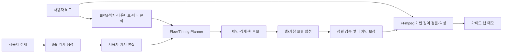

# PMTM 프로젝트 목표

## 1. 한 문장 목표

PMTM은 사용자가 비트와 주제를 입력하면 좋은 랩 가사를 생성하고 자유롭게 수정하게 한 뒤, 별도의 Flow/Audio 파이프라인이 그 가사를 비트 위에서 해석해 AI 가이드 랩 데모로 들려주는 창작 보조 서비스다.

## 2. 핵심 제품 원칙

제품은 최종적으로 가사의 플로우를 들려주지만, 가사 LLM은 플로우를 학습하지 않는다.

플로우는 가사의 고정 속성이 아니라 가사를 비트 안에서 어떻게 발화할지에 대한 시간적 해석이다. 같은 가사와 같은 비트에도 half-time, double-time, 당김음, 쉼, 강세와 구절 분할이 다른 여러 유효한 플로우가 존재한다. 따라서 PMTM은 비트마다 하나의 정답 플로우나 정답 음절 수가 있다고 가정하지 않는다.

제품의 책임은 다음과 같이 분리한다.

| Layer | Input | Responsibility | Output |
|---|---|---|---|
| Beat Analysis | 비트 | BPM, 박자표, 다운비트, 마디, 드럼 밀도와 여백 분석 | 비트 그리드와 리듬 특성 |
| Lyrics LLM | 주제와 가사 스타일 조건 | 주제 전개, 자연스러운 한국어, 라임과 반복 억제 | 편집 가능한 8줄 가사 |
| Flow/Timing Planner | 최종 가사와 비트 분석 결과 | 구절 분할, 시작 위치, duration, 쉼과 강세 후보 생성 | 하나 이상의 플로우 후보 |
| Vocal/Mix | 플로우 후보와 비트 | 가이드 보컬 합성, 정렬과 믹싱 | 가이드 랩 데모 |

## 3. 해결하려는 문제

일반적인 LLM은 랩처럼 보이는 가사를 만들 수 있지만 주제 전개, 자연스러운 한국어, 라임과 반복 억제 품질이 안정적이지 않다. 일반 TTS는 문장을 자연스럽게 읽는 데 초점이 있어 박자, 강세, 쉼과 랩의 시간적 표현을 직접 제어하기 어렵다.

PMTM은 다음 과정을 하나의 작업 흐름으로 연결한다.

1. 비트의 BPM, 박자표, 마디 위치와 리듬 특성을 분석한다.
2. 사용자가 입력한 주제에 맞춰 랩 가사를 생성한다.
3. 사용자가 생성된 가사를 직접 수정한다.
4. 별도의 Flow/Timing Planner가 최종 가사와 비트를 조합해 하나 이상의 플로우를 만든다.
5. 선택한 플로우로 가이드 보컬을 합성하고 비트와 병합한다.

가사 생성과 플로우 생성을 분리하면 사용자는 좋은 가사를 유지한 채 플로우만 바꾸거나, 플로우 후보를 유지한 채 가사 일부를 수정할 수 있다.

## 4. 핵심 사용자 경험

### 4.1 비트와 주제 입력

사용자는 원하는 비트 파일을 업로드하고 가사의 주제를 입력한다. 필요하면 벌스 길이, 분위기, 라임 스킴과 라임 강도를 가사 옵션으로 선택할 수 있다.

플로우 밀도, 박자 해석, 강세와 쉼은 가사 LLM 조건이 아니라 Flow/Audio 단계의 선택값이다. 초기 제품에서는 비트 분석 결과로 기본값을 제안하고 사용자가 바꿀 수 있게 한다.

### 4.2 랩 가사 생성

가사 LLM은 비트 타이밍을 예측하지 않고 다음 품질에 집중한다.

- 사용자가 제시한 주제와 의미 전개
- 자연스러운 한국어
- 끝 라임과 내부 라임
- 동일 줄, 끝단어와 구절의 반복 억제
- 편집하기 쉬운 정확한 8줄 형식

8줄은 텍스트 편집 단위이며 반드시 8마디를 뜻하지 않는다. 실제 마디 배치에서는 한 줄을 여러 구절로 나누거나 여러 줄을 이어 발화할 수 있다.

### 4.3 가사 편집

사용자는 생성된 가사를 줄 단위로 자유롭게 수정한다. 편집 화면은 다음 정보를 후처리로 제공할 수 있다.

- 발음 기준 예상 음절 수
- 라임이 연결되는 구간
- 동일 단어, 구절과 끝단어의 과도한 반복 경고
- 현재 플로우 후보를 적용했을 때의 과밀 구간과 호흡 지점

음절 수와 과밀 경고는 수정 판단을 돕는 진단 정보다. 권장 범위를 벗어났다는 이유만으로 가사를 잘못된 출력으로 판정하지 않는다.

### 4.4 플로우 후보와 가이드 랩 데모

Flow/Timing Planner는 최종 가사와 비트 분석 결과를 조합해 구절 분할, 박자 위치, duration, 쉼과 강세가 다른 후보를 만든다. 사용자는 같은 가사를 서로 다른 플로우로 미리 듣고 선택할 수 있다.

선택한 타이밍은 보컬 합성 모델에 전달되고, 생성된 랩 보컬은 원본 비트와 병합된다. 결과물은 완성 음원이 아니라 작사와 플로우를 검토하기 위한 가이드 데모다.

## 5. 품질의 정의

### 5.1 좋은 랩 가사

- 사용자가 제시한 주제에서 벗어나지 않는다.
- 관련 단어를 나열하는 데 그치지 않고 벌스 전체에 최소한의 전개가 있다.
- 한국어 문장과 줄 사이의 의미 연결이 자연스럽다.
- 끝 라임과 내부 라임을 활용하되 의미나 문법을 지나치게 훼손하지 않는다.
- 같은 단어를 그대로 반복해 라임을 맞추는 방식에 의존하지 않는다.
- 동일 줄, 끝단어, 문구와 n-gram의 과도한 반복을 피한다.
- 줄 경계가 명확해 사용자가 쉽게 수정할 수 있다.

### 5.2 좋은 플로우 데모

- 보컬의 시작과 구절 경계가 비트 그리드에서 의도한 위치에 있다.
- 가사가 지나치게 뭉개지거나 누락되지 않는다.
- 쉼, 강세와 밀도 변화가 사용자가 선택한 해석으로 들린다.
- 같은 가사에 대해 성격이 구분되는 여러 후보를 제공할 수 있다.
- 사용자가 타이밍과 강세를 수정하거나 다른 후보를 선택할 수 있다.

좋은 플로우는 하나의 정답에 대한 일치율로 판단하지 않는다. 타이밍 안정성, 발음 명료도, 후보 간 다양성과 사람 청취 선호도를 함께 평가한다.

### 5.3 편집 가능성

- 가사, 플로우 타이밍과 보컬 렌더링 결과를 분리해 저장한다.
- 가사를 수정하면 음절 수와 타이밍 영향 구간을 다시 계산할 수 있다.
- 플로우를 바꿔도 원본 가사는 유지된다.
- 일부 줄만 수정하거나 일부 구간의 오디오만 다시 생성할 수 있다.

## 6. 비트 분석 목표

BPM 하나만으로 플로우를 결정할 수 없다. Beat Analysis는 다음 정보를 추출해 Flow/Timing Planner와 오디오 정렬에 제공한다.

- BPM과 신뢰도
- 박자표
- 다운비트와 마디 경계
- 비트 시작 오프셋
- 킥, 스네어, 하이햇 중심의 드럼 밀도
- 에너지와 여백
- half-time/double-time 가능성
- 인트로, 벌스와 훅 등 섹션 경계 후보

이 정보는 가사 LLM의 필수 입력이나 학습 정답이 아니다. 박자표나 마디 경계를 자동으로 확정하기 어려우면 4/4를 기본값으로 제안하되 사용자가 수정할 수 있게 한다.

## 7. 가사 생성 모델 튜닝 목표

가사 모델의 구체적인 학습 계약과 통과 기준은 [`pmtm-ai/docs/goal-alignment.md`](../pmtm-ai/docs/goal-alignment.md)를 따른다.

### 7.1 모델 입력

- 주제
- 벌스 줄 수: 초기에는 8줄 고정
- 원하는 분위기(선택)
- 라임 스킴과 라임 강도(선택)

BPM, 박자표, 목표 음절 범위, flow density, 박자 위치와 duration은 가사 LLM의 학습 입력이나 reward로 사용하지 않는다.

### 7.2 모델 출력

가사 LLM은 정확히 8개의 가사 줄과 `[End]`만 출력한다. 음절 수, 반복률과 라임 지표는 결정론적 후처리기가 계산한다. 구절 분할, 시작 박자, duration, 쉼과 강세는 Flow/Timing Planner가 별도로 생성한다.

```json
{
  "lyrics": [
    "첫 번째 가사 줄",
    "두 번째 가사 줄",
    "세 번째 가사 줄",
    "네 번째 가사 줄",
    "다섯 번째 가사 줄",
    "여섯 번째 가사 줄",
    "일곱 번째 가사 줄",
    "여덟 번째 가사 줄"
  ],
  "end": true
}
```

서비스 API는 후처리 결과를 함께 반환할 수 있지만, 이를 모델이 직접 생성한 값과 구분한다.

### 7.3 학습 전략

1. **데이터 정제**: 주제, 자연스러운 한국어, 의미 전개, 라임과 반복 억제가 검수된 샘플을 확보한다.
2. **SFT**: 좋은 한국어 랩 가사와 정확한 출력 형식의 기본 분포를 학습한다.
3. **GRPO**: 8줄과 `[End]`, 명시된 라임 스킴, 동일 줄·끝단어·n-gram 반복처럼 결정적으로 판정 가능한 텍스트 조건만 강화한다.
4. **사람 평가 또는 선호도 학습**: 주제 전개, 자연스러움, 창의성과 전체 가사 선호도를 평가한다.

가사 LLM 학습에서 플로우를 대리하는 줄 길이, BPM별 음절 범위 또는 호흡 규칙을 최적화하지 않는다. 플로우 품질은 Flow/Audio 파이프라인의 데이터와 청취 평가로 별도 개선한다.

## 8. Flow/Audio 파이프라인



### 8.1 플로우와 타이밍 생성

최종 가사를 발음 음절과 음소로 변환하고 비트 그리드 위에 배치한다. Flow/Timing Planner는 한 줄을 여러 구절로 나누거나 여러 줄을 이어 배치할 수 있으며, 강박에 둘 핵심 단어, 쉼, 당김음과 밀도 변화를 후보별로 다르게 만든다.

초기 구현은 규칙 기반 또는 최적화 기반 planner로 시작할 수 있다. 이후 사람의 타이밍 편집 기록이나 라이선스가 확인된 정렬 데이터를 확보하면 전용 duration/flow 모델을 별도로 학습할 수 있다. 이 모델은 가사 LLM과 데이터, loss, 평가 및 배포 버전을 공유하지 않는다.

MFA(Montreal Forced Aligner)는 이미 녹음된 음성과 가사의 음소 타이밍을 정렬하거나 합성 결과를 검증할 때 활용할 수 있다. 텍스트만으로 새로운 랩 플로우를 생성하는 도구는 아니므로 최초 duration은 Flow/Timing Planner가 생성한다.

### 8.2 보컬 합성

- **DiffSinger 계열**: 음소, 음높이와 duration을 입력할 수 있는 가창 합성 모델로서 랩 타이밍을 직접 제어하는 후보
- **So-VITS-SVC 계열**: 이미 생성하거나 녹음한 가이드 보컬의 음색을 바꾸는 보이스 컨버전 후보
- **리듬 제어 가능한 다른 보컬 합성 모델**: 한국어 지원, 라이선스, 지연 시간과 품질을 기준으로 비교 검증

So-VITS-SVC는 텍스트에서 보컬을 직접 생성하지 않으므로 사용할 경우 먼저 리듬이 맞는 소스 보컬을 만들고 음색을 변환한다.

### 8.3 믹싱과 결과 제공

합성 보컬의 시작 오프셋과 길이를 원본 비트에 맞춘 뒤 FFmpeg로 병합한다. 초기 데모에서는 다음을 지원한다.

- 보컬 시작 위치와 마디 정렬
- 비트와 보컬 볼륨 조절
- 필요 시 간단한 EQ, 컴프레서와 리버브
- WAV 또는 MP3 결과 제공

## 9. 단계별 개발 목표

### Phase 1. 가사 생성

- 주제와 선택적 가사 스타일 입력
- 정확한 8줄 가사 생성
- 라임과 반복 후처리
- 고정 평가셋과 사람 가사 평가

**완료 기준:** 8줄 형식, 주제 관련성, 한국어 자연스러움, 라임과 반복 억제 기준을 통과한다. 비트 적합성이나 플로우를 가사 모델 완료 기준으로 사용하지 않는다.

### Phase 2. 가사 편집 경험

- 줄 단위 편집과 부분 재생성
- 발음 음절 수 재계산
- 라임과 반복 표시
- 가사와 플로우 데이터 분리 저장

**완료 기준:** 사용자가 가사를 수정하고 변경된 구간만 다음 오디오 단계로 넘길 수 있다.

### Phase 3. 플로우 후보와 가이드 보컬

- 비트 분석과 그리드 생성
- 하나 이상의 Flow/Timing 후보 생성
- 랩 가능한 보컬 합성 모델 검증
- 비트와 보컬 병합
- 비동기 데모 생성과 재생

**완료 기준:** 생성 보컬의 시작과 구절 경계가 의도한 비트 위치에서 크게 벗어나지 않고, 사용자가 플로우 후보의 차이를 듣고 선택할 수 있다.

### Phase 4. 품질 고도화

- 성격이 구분되는 다양한 플로우 후보
- 사용자가 타이밍, 쉼과 강세를 수정하는 기능
- 보컬 스타일 선택
- 사용자 편집 및 청취 선호 데이터 기반 Flow/Audio 개선

**완료 기준:** 같은 가사와 비트에 대해 유효하고 구분 가능한 플로우 후보를 제공하며, 사용자 청취 선호와 편집 완료 시간이 개선된다.

## 10. 품질 평가 지표

### 가사 LLM

- 정확한 8줄과 `[End]` 출력률
- 동일 줄, 끝단어와 n-gram 반복률
- 지정 라임 스킴 준수율
- 끝 라임과 내부 라임 지표
- 사람 평가 기반 주제 관련성과 의미 전개
- 사람 평가 기반 한국어 자연스러움
- 베이스 또는 이전 모델 대비 블라인드 가사 선호도

### Flow/Audio

- 다운비트 대비 보컬 시작 오차
- 의도한 구절 경계 대비 타이밍 오차
- 음절 누락과 뭉개짐 비율
- 타이밍 수정 없이 재생 가능한 후보 비율
- 후보 간 리듬 패턴 다양성
- 생성 시간
- 플로우 이해도와 청취 선호도

가사 LLM의 모델 승격은 가사 지표로만 결정한다. 플로우와 비트 위 랩 가능성은 Flow/Audio 버전의 승격 기준으로 별도 관리하고, 최종 제품 릴리스에서는 두 계층을 조합한 통합 청취 평가를 추가한다.

## 11. 범위와 원칙

- PMTM의 1차 목적은 상업 발매용 완성 음원을 자동 제작하는 것이 아니라, 작사와 플로우를 빠르게 검토할 수 있는 가이드 데모를 제공하는 것이다.
- 같은 가사와 비트에 하나의 정답 플로우가 있다고 가정하지 않는다.
- 가사 LLM에 BPM, 목표 음절 수나 줄 길이로 플로우를 강제하지 않는다.
- 가사, 플로우 타이밍과 보컬 음색 모델을 독립적으로 교체하고 평가할 수 있게 한다.
- 특정 아티스트의 목소리나 스타일을 무단 복제하지 않는다.
- 학습 데이터, 비트와 보컬 모델은 사용 권한과 라이선스를 확인한다.
- 사용자 업로드 비트와 가사는 명확한 보관 및 삭제 정책에 따라 처리한다.

## 12. 최종 성공 기준

사용자는 하나의 작업 흐름 안에서 다음을 완료할 수 있어야 한다.

1. 비트와 주제를 입력한다.
2. 주제, 자연스러운 한국어와 라임을 갖춘 랩 가사를 생성한다.
3. 가사를 원하는 대로 수정한다.
4. 같은 가사에 적용할 수 있는 플로우 후보를 듣고 선택한다.
5. 선택한 플로우가 적용된 AI 가이드 랩 데모를 듣는다.

최종적으로 PMTM은 가사 LLM이 좋은 랩 가사를 만들고, 별도의 Flow/Audio 파이프라인이 그 가사를 비트 위에서 다양하게 해석해 들려주는 창작 도구를 지향한다.
