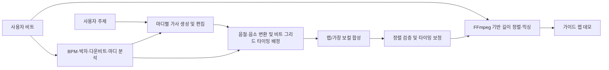

# PMTM 프로젝트 목표

## 1. 한 문장 목표

PMTM은 사용자가 비트와 주제를 입력하면 비트의 리듬 구조에 어울리는 랩 벌스를 생성하고, 사용자가 가사를 자유롭게 수정한 뒤, 해당 가사를 비트 위에 AI 가이드 보컬로 얹은 데모 음원까지 들려주는 랩 창작 보조 서비스다.

## 2. 해결하려는 문제

일반적인 LLM은 문장이나 운율이 있는 가사를 만들 수 있지만, 실제 비트의 마디 구조와 발화 밀도를 고려하지 않기 때문에 가사를 비트에 바로 얹기 어렵다. 일반 TTS 역시 자연스럽게 문장을 읽는 데 초점이 있어 박자, 강세, 쉼, 플로우를 랩처럼 제어하기 어렵다.

PMTM은 다음 과정을 하나의 작업 흐름으로 연결한다.

1. 비트의 BPM, 박자표, 마디 위치와 리듬 특성을 분석한다.
2. 사용자가 입력한 주제에 맞춰 마디별 랩 가사를 생성한다.
3. 사용자가 생성된 가사를 직접 수정한다.
4. 수정된 가사를 비트의 타이밍에 맞춰 가이드 랩 보컬로 합성한다.
5. 비트와 보컬을 병합한 데모 음원을 제공한다.

## 3. 핵심 사용자 경험

### 3.1 비트와 주제 입력

사용자는 원하는 비트 파일을 업로드하고 가사의 주제를 입력한다. 필요하면 벌스 길이, 분위기, 플로우 밀도, 라임 강도 같은 옵션을 추가로 선택할 수 있다.

### 3.2 비트에 맞는 랩 벌스 생성

서비스는 비트를 분석한 결과를 바탕으로 마디별 적정 음절 수, 쉼표 위치, 문장 길이와 라임 구조를 결정한다. 생성 결과는 기본적으로 각 줄이 한 마디에 대응하도록 구성하고, 필요한 경우 한 마디 안의 분할 지점도 함께 표현한다.

예상 가이드:

- 80~90 BPM의 4/4 붐뱁 비트: 16분음표 흐름을 기준으로 한 마디에 약 12~16음절
- 130~140 BPM의 4/4 트랩 비트: 빠른 체감 속도와 분할 플로우를 고려해 한 구간을 약 8~10음절로 끊어 배치

위 수치는 고정 규칙이 아니라 초기 휴리스틱이다. 실제 적정 음절 수는 BPM뿐 아니라 half-time/double-time 해석, 드럼 밀도, 여백, 발화 속도, 쉼과 강세에 따라 달라진다.

### 3.3 가사 편집

사용자는 생성된 가사를 줄 또는 마디 단위로 자유롭게 수정할 수 있다. 편집 중에도 다음 정보를 확인할 수 있어야 한다.

- 마디별 예상 음절 수와 권장 범위
- 호흡 또는 쉼 위치
- 라임이 연결되는 구간
- 동일 단어, 구절, 끝단어의 과도한 반복 경고
- 비트 대비 발화 밀도가 너무 높거나 낮은 구간

### 3.4 가이드 랩 데모 생성

서비스는 최종 가사를 박자 정보와 함께 보컬 합성 모델에 전달하고, 생성된 랩 보컬을 원본 비트와 병합한다. 사용자는 완성 음원이 아니라 작사와 플로우를 검토하기 위한 가이드 데모를 듣게 된다.

## 4. 좋은 랩 벌스의 정의

PMTM이 생성해야 하는 좋은 랩 벌스는 다음 조건을 만족한다.

### 4.1 비트 적합성

- BPM과 박자표를 고려한다.
- 각 마디의 음절 수와 발화 밀도가 실제로 소화 가능한 범위에 있다.
- 마디의 시작, 강박, 약박, 쉼과 문장 경계가 자연스럽다.
- 같은 BPM이라도 장르, 드럼 밀도와 half-time/double-time feel에 따라 다른 플로우를 선택한다.

### 4.2 주제 일관성

- 사용자가 제시한 주제에서 벗어나지 않는다.
- 단순히 관련 단어를 나열하지 않고 벌스 전체에 최소한의 전개가 있다.
- 한국어 문장이 자연스럽고 의미가 연결된다.

### 4.3 라임 품질

- 끝 라임과 내부 라임을 자연스럽게 활용한다.
- 라임을 위해 의미나 문법을 지나치게 훼손하지 않는다.
- 동일 단어를 그대로 반복하는 방식에 의존하지 않는다.
- 같은 끝단어, 문구, n-gram의 과도한 반복을 피한다.

### 4.4 편집 가능성

- 마디와 줄의 경계가 명확하다.
- 사용자가 일부 가사를 바꿔도 음절 수와 타이밍을 다시 계산할 수 있다.
- 가사와 타이밍 정보가 분리된 구조화 데이터로 관리된다.

## 5. 비트 분석 목표

BPM 하나만으로는 비트에 맞는 플로우를 충분히 설명할 수 없다. 최종적으로 다음 정보를 추출해 가사 생성 조건으로 사용한다.

- BPM과 신뢰도
- 박자표
- 다운비트와 마디 경계
- 비트 시작 오프셋
- 킥, 스네어, 하이햇 중심의 드럼 밀도
- 에너지와 여백
- half-time/double-time 가능성
- 인트로, 벌스, 훅 등 섹션 경계 후보

박자표나 마디 경계를 자동으로 확정하기 어려운 경우에는 4/4를 기본값으로 제안하되, 사용자가 수정할 수 있게 한다.

## 6. 가사 생성 모델 튜닝 목표

### 6.1 모델 입력

모델에는 최소한 다음 조건을 제공한다.

- 주제
- BPM
- 박자표
- 벌스 마디 수
- 마디별 목표 음절 범위 또는 flow density
- 비트의 에너지, 여백과 드럼 밀도
- 원하는 분위기와 라임 강도(선택)

### 6.2 모델 출력

화면에 표시할 가사뿐 아니라 오디오 합성에 사용할 구조화 정보도 함께 생성하거나 후처리한다.

```json
{
  "bpm": 90,
  "timeSignature": "4/4",
  "bars": [
    {
      "bar": 1,
      "lyrics": "첫 번째 마디의 가사",
      "syllableCount": 12,
      "targetSyllableRange": [12, 16],
      "rhymeGroup": "A",
      "phrases": [
        {
          "text": "첫 번째 구절",
          "startBeat": 1.0,
          "durationBeats": 2.0
        }
      ]
    }
  ]
}
```

초기 단계에서는 LLM이 가사와 마디 경계를 생성하고, 음절 수와 반복 여부는 결정론적 후처리기로 검증한다. 세부 음소 타이밍은 LLM이 임의로 예측하게 하기보다 비트 그리드와 별도 정렬 알고리즘으로 계산한다.

### 6.3 학습 전략

1. **데이터 정제**: 마디 경계, BPM, 박자표와 가사 정렬의 신뢰도가 높은 샘플을 우선 확보한다.
2. **SFT**: 자연스러운 한국어, 마디 구조, 라임과 반복 억제를 갖춘 예시로 기본 생성 분포를 학습한다.
3. **선호도 학습 또는 GRPO**: 음절 범위 준수, 줄 수, 라임, 반복 억제처럼 자동 평가 가능한 목표를 강화한다.
4. **사람 평가**: 의미, 창의성, 실제 랩 가능성처럼 자동 점수만으로 판단하기 어려운 품질을 평가한다.

BPM은 텍스트만으로 강하게 학습하기 어려운 약한 조건이므로, `flow density`, 마디별 음절 수와 실제 발화 타이밍을 함께 라벨링하는 것이 중요하다.

## 7. 가이드 랩 오디오 파이프라인



### 7.1 타이밍 생성

가사 편집 결과를 음절과 음소 단위로 변환하고, 각 단위를 비트 그리드에 배치한다. 강박에 둘 핵심 단어, 쉼, 당김음과 한 마디 안의 구절 분할을 표현할 수 있어야 한다.

MFA(Montreal Forced Aligner)는 이미 녹음된 음성과 가사의 음소 타이밍을 정렬하거나 합성 결과를 검증할 때 활용할 수 있다. 텍스트만으로 새로운 랩 타이밍을 만들어 주는 도구는 아니므로, 최초 duration은 비트 분석과 플로우 규칙을 이용해 별도로 생성해야 한다.

### 7.2 보컬 합성

- **DiffSinger 계열**: 음소, 음높이와 duration을 입력할 수 있는 가창 합성 모델로서 랩 타이밍을 직접 제어하는 후보
- **So-VITS-SVC 계열**: 이미 생성하거나 녹음한 가이드 보컬의 음색을 바꾸는 보이스 컨버전 후보
- **리듬 제어 가능한 다른 보컬 합성 모델**: 한국어 지원, 라이선스, 지연 시간과 품질을 기준으로 비교 검증

So-VITS-SVC는 텍스트에서 보컬을 직접 생성하는 모델이 아니므로, 사용할 경우 먼저 리듬이 맞는 소스 보컬을 만들고 그 음색을 변환하는 단계가 필요하다.

### 7.3 믹싱과 결과 제공

합성 보컬의 시작 오프셋과 길이를 원본 비트에 맞춘 뒤 FFmpeg로 병합한다. 초기 데모에서는 다음을 지원한다.

- 보컬 시작 위치와 마디 정렬
- 비트와 보컬 볼륨 조절
- 필요 시 간단한 EQ, 컴프레서와 리버브
- WAV 또는 MP3 결과 제공

## 8. 단계별 개발 목표

### Phase 1. 비트 기반 가사 생성

- 비트 업로드
- BPM과 기본 마디 그리드 분석
- 주제 입력
- 마디별 가사 생성
- 음절 수, 라임과 반복 검증

**완료 기준:** 생성된 벌스가 지정한 줄/마디 수를 지키고, 각 마디의 음절 수가 목표 범위에 들어오며, 주제 이탈과 과도한 중복이 적다.

### Phase 2. 가사 편집 경험

- 줄/마디 단위 편집
- 편집 후 음절 수와 발화 밀도 재계산
- 라임과 반복 표시
- 부분 재생성

**완료 기준:** 사용자가 가사를 수정한 뒤에도 문제 구간을 확인하고 다시 오디오 생성 단계로 넘길 수 있다.

### Phase 3. 가이드 보컬 생성

- 음절/음소 타이밍 생성
- 랩 가능한 보컬 합성 모델 검증
- 비트와 보컬 병합
- 비동기 데모 생성과 재생

**완료 기준:** 생성 보컬의 마디 시작과 끝이 비트에서 크게 벗어나지 않고, 사용자가 가사의 플로우를 판단할 수 있는 데모를 들을 수 있다.

### Phase 4. 품질 고도화

- 비트 특성에 따른 다양한 플로우 생성
- 사용자가 타이밍과 강세를 수정하는 기능
- 보컬 스타일 선택
- 사람 평가 데이터 기반 모델 개선

**완료 기준:** 같은 주제라도 비트 특성에 따라 음절 밀도, 쉼과 라임 배치가 구분되고, 사용자 평가에서 비트 적합성이 개선된다.

## 9. 품질 평가 지표

### 가사 생성

- 마디 수 준수율
- 마디별 목표 음절 범위 준수율
- 동일 줄, 끝단어와 n-gram 반복률
- 끝 라임 및 내부 라임 점수
- 주제 관련성
- 한국어 자연스러움
- 사람 평가 기반 랩 가능성 및 비트 적합성

### 오디오 데모

- 다운비트 대비 보컬 시작 오차
- 마디 경계 초과율
- 음절 누락 및 뭉개짐 비율
- 보컬과 비트의 박자 일치도
- 생성 시간
- 사용자가 플로우를 이해할 수 있는지에 대한 청취 평가

자동 지표는 학습과 회귀 테스트에 사용하되, 최종 품질 판단은 실제 비트 위에서의 사람 청취 평가와 함께 수행한다.

## 10. 범위와 원칙

- PMTM의 1차 목적은 상업 발매용 완성 음원을 자동 제작하는 것이 아니라, 작사와 플로우를 빠르게 검토할 수 있는 가이드 데모를 제공하는 것이다.
- 특정 아티스트의 목소리나 스타일을 무단 복제하지 않는다.
- 학습 데이터, 비트와 보컬 모델은 사용 권한과 라이선스를 확인한다.
- 사용자 업로드 비트와 가사는 명확한 보관 및 삭제 정책에 따라 처리한다.
- 음절 수 규칙 하나에 모든 비트를 맞추지 않고, 실제 청취 평가를 통해 휴리스틱을 지속적으로 보정한다.

## 11. 최종 성공 기준

사용자는 하나의 작업 흐름 안에서 다음을 완료할 수 있어야 한다.

1. 비트와 주제를 입력한다.
2. 비트의 리듬 구조에 맞는 랩 벌스를 생성한다.
3. 가사를 원하는 대로 수정한다.
4. 수정한 가사를 비트에 맞춘 AI 가이드 랩으로 듣는다.

최종적으로 PMTM은 단순히 “랩처럼 보이는 텍스트”를 만드는 서비스를 넘어, 사용자가 비트 위에서 실제로 사용할 수 있는 가사와 플로우를 함께 설계하는 창작 도구를 지향한다.
