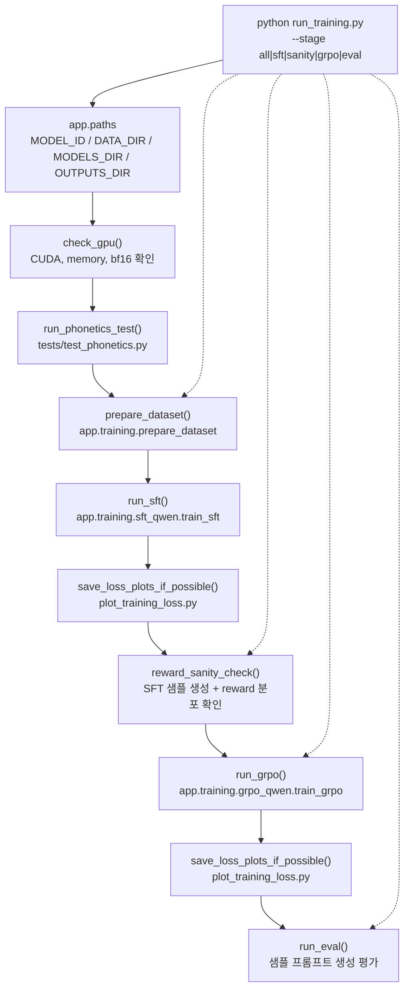
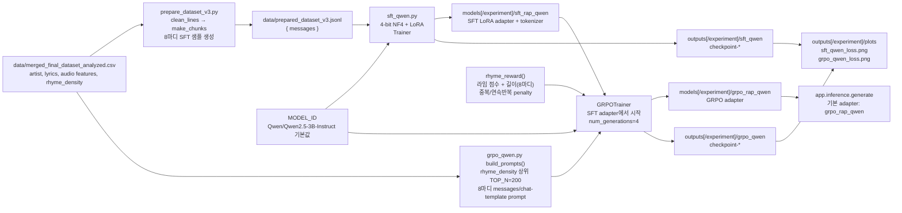

# PMTM AI Training Pipeline

이 문서는 현재 `pmtm-ai` 코드 기준 학습 파이프라인을 도식화한 것이다.

## Assumptions

- 실행 엔트리포인트는 `run_training.py`이다.
- 기본 베이스 모델은 `Qwen/Qwen2.5-3B-Instruct`이며, `PMTM_MODEL_ID`로 바꿀 수 있다.
- `PMTM_EXPERIMENT_NAME`을 주면 `models/<experiment>`와 `outputs/<experiment>` 아래에 결과가 저장된다.
- `PMTM_DATA_DIR`, `PMTM_MODELS_DIR`, `PMTM_OUTPUTS_DIR`로 데이터/모델/체크포인트 루트 경로를 바꿀 수 있다.

## End-to-End Flow

## Data And Model Flow

## Stage Behavior

| Stage | Command | Main work | Required input | Main output |
|---|---|---|---|---|
| `all` | `python run_training.py` | phonetics test, dataset prep, SFT, reward sanity, GRPO, eval | GPU, CSV dataset | SFT/GRPO adapters, checkpoints, loss plots |
| `sft` | `python run_training.py --stage sft` | build messages-format SFT JSONL if missing, train SFT LoRA | `data/merged_final_dataset_analyzed.csv` | `models[/experiment]/sft_rap_qwen` |
| `sanity` | `python run_training.py --stage sanity` | generate 20 completions with SFT and print reward stats | SFT adapter | reward mean/stdev/min/max |
| `grpo` | `python run_training.py --stage grpo` | train GRPO from SFT adapter | SFT adapter, analyzed CSV | `models[/experiment]/grpo_rap_qwen` |
| `eval` | `python run_training.py --stage eval` | generate sample lyrics | GRPO adapter, or SFT fallback | console samples |

## Key Checks

- SFT is skipped when `models[/experiment]/sft_rap_qwen` already exists unless `--force` is passed.
- SFT and GRPO resume from the latest `outputs[/experiment]/*/checkpoint-*` checkpoint.
- `reward_sanity_check()` should be run before GRPO unless deliberately skipped with `--skip-sanity`.
- `plot_training_loss.py` reads `trainer_state.json` files under checkpoint directories, so plots appear only after checkpoints with loss history exist.
